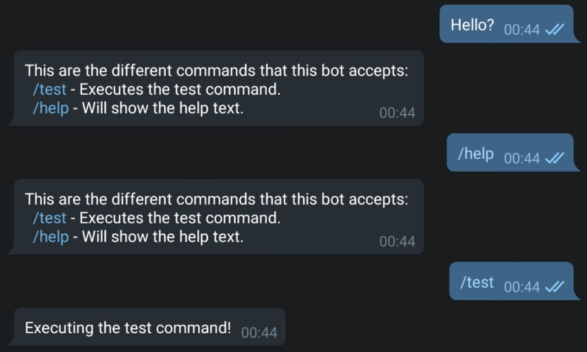

# Telego

[](https://circleci.com/gh/davilag/telego)
[](https://goreportcard.com/badge/github.com/davilag/telego)
[](https://godoc.org/github.com/davilag/telego)

Telego is a Go framework for Telegram bots. It helps you building Telegram applications interacting with the [Telegram Bot API](https://core.telegram.org/bots/api) for you. It also gives you tools like flows which gives you the abiity to define steps for specific messages from the users.

# Usage

For full details of all the available functionallity that Telego provides, please go to the [full docs](https://godoc.org/github.com/davilag/telego)

## Initialise Telego

The first thing that you have to do to use telego is [create a Telegram bot](https://core.telegram.org/bots#creating-a-new-bot) and get its bot token.
Once you have the token, you can initialise your bot doing:

```go
bot = telego.Initialise("110201543:testTraceToken")
```

This method is going to initialise the basics to make the bot work. At this point, your bot is not going to be able to read any message. In order to get messages from Telegram, there are different ways of [getting updates](https://core.telegram.org/bots/api#getting-updates), this bot (for now) only supports long polling. To start the long poll, you will need to execute the `Listen` metho that it's available from the `Telego` structure:

```go
bot = telego.Initialise("110201543:testTraceToken")
bot.Listen()
```

`Listen`, on an infinite loop, makes a [request to Telegram](https://core.telegram.org/bots/api#getupdates) to get the latest messages for your bot.

## Message handlers

Telego provides an easy way to handle different kind of messages. In order to handle messages, you will need first to define different [FlowStep](https://godoc.org/github.com/davilag/telego#FlowStep) functions.

This functions are going to have two paramenters the `Update` which si going to contain the message that the user has sent to the bot and the `Conversation` which is going to allow you to easily message back the user and access the conversation context. This functions are also going to return another `FlowStep` function, which is going to be used for flows.

This is the simplest example of a `FlowStep` function, which is going to send to the user the same message that they have sent and will finish the flow after that.

```go
func echoStep(u api.Update, c telego.Conversation) telego.FlowStep {
	c.SendMessage(u.Message.Text)
	return nil
}
```

In order to make your bot react to different messages, there are three different kind of handlers:

- [Kind handler](#kind-handler)
- [Command handler](#command-handler)
- [Default handler](#default-handler)

### Kind handler

You can define handlers for the different kind of messages that the user can send to your bot. All the different kinds are defined [here](https://godoc.org/github.com/davilag/telego/kind).

On this example, we are going to reply just to the messages that are a location sending the user a message back:

```go
package main

import (
	"github.com/davilag/telego"
	"github.com/davilag/telego/api"
	"github.com/davilag/telego/kind"
)

func main() {
	bot := telego.Initialise("110201543:testTraceToken")

	bot.AddKindHandler(kind.Location, locationHandler)
	bot.Listen()
}

func locationHandler(u api.Update, c telego.Conversation) telego.FlowStep {
	c.SendMessage("That's a nice place!")
	return nil
}

```

And this is the output that we are going to have from our bot:


### Command handler

The normal way of starting an interaction with a bot are [commands](https://core.telegram.org/bots#commands). In order to set a handler for commands, we will need to call `AddCommandHandlder`.

This example shows how to handle the `/test` command:

```go
package main

import (
	"github.com/davilag/telego"
	"github.com/davilag/telego/api"
)

func main() {
	bot := telego.Initialise("110201543:testTraceToken")

	bot.AddCommandHandlder("test", commandHandler)
	bot.Listen()
}

func commandHandler(u api.Update, c telego.Conversation) telego.FlowStep {
	c.SendMessage("¯Not sure what to do...")
	return nil
}

```

And this is the result of interacting with the bot:


### Default handler

With Telego you also have the ability to react by default to any message. This is usually used to show the user a help message, for example to show them all the commands that you have. To initialise the default handler, you will need to use `SetDefaultMessageHandler`.

This default handler will be the last option of the bot in order to respond to the user's message. This is, if the message is compilant with another other defined handler (eg. kind or command), then this handler is not going to be executed.

On this example, we are going to be handling three kinds of messages, a `/test` command message, a `/help` command message and a default message which is going to show the help information:

```go
package main

import (
	"github.com/davilag/telego"
	"github.com/davilag/telego/api"
)

func main() {
	bot := telego.Initialise("110201543:testTraceToken")
	bot.SetDefaultMessageHandler(helpCommand)
	bot.AddCommandHandlder("test", testCommand)
	bot.AddCommandHandlder("help", helpCommand)
	bot.Listen()
}

func helpCommand(u api.Update, c telego.Conversation) telego.FlowStep {
	c.SendMessage(`This are the different commands that this bot accepts:
		/test - Executes the test command.
		/help - Will show the help text.`)
	return nil
}

func testCommand(u api.Update, c telego.Conversation) telego.FlowStep {
	c.SendMessage("Executing the test command!")
	return nil
}
```

This configuration has the next output:

